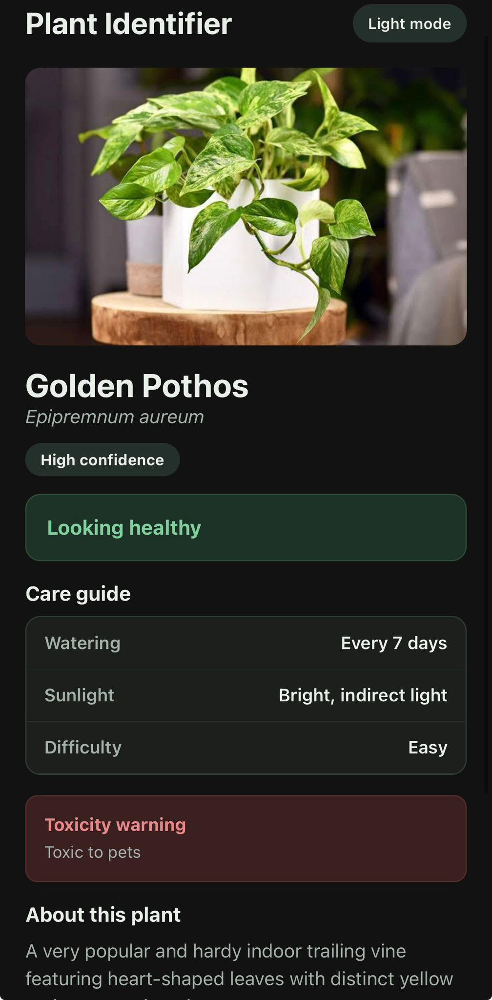
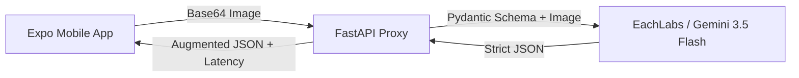

# Plant Identifier App

A React Native application that uses vision-capable AI to identify plants, diagnose health issues, and provide structured care metrics.



## Deployment
1. Add your key to the .env file like in .env.example
2. Put your PC's IP address into the docker compose file's relevant field
3. Have docker compose installed and run the following from the root directory:
```
docker compose up --build
```

You can now reach the application from localhost:8081 on your computers browser.  
Alternatively, you can use expo mobile application to connect and view the mobile application.  

## Architecture



## AI Decisions:
**Instructor for Data Contracts:** Rather than relying on raw prompt engineering to guarantee JSON shapes, I used instructor patched over the OpenAI client. This maps the model's output directly to a strict Pydantic schema, eliminating parsing errors and hallucinations.

**Few-Shot via Chat History:** Instead of placing examples inside the system prompt, I structured the few-shot examples as actual user/assistant chat turns. This aligns better with how instruction-tuned models are trained and resulted in much higher schema adherence and better performance.

**Model Selection:** The backend uses Gemini 3.5, served over EachLabs API. This model was chosen thanks to its scrong multimodal capabilities, and perfect performance on tests.
